{width=75%}


```{r setup, include=FALSE}
knitr::opts_chunk$set(echo = TRUE)
##Knitting
```

The purpose of this document is to serve as a guide and a reference to develop a R Markdown document into an HTML format to host online using GitHub Pages.

# Introduction to Git Hub

## Git, GitHub, and R Studio
This information is provided by the LASER institute

**Git**

* A version control system
* Tracks history of changes for individuals or collaborative teams
* Git repositories (or projects) encompass all files and folders associated with a project along with each files revision history

**GitHub**

* a web-based platform that hosts Git repositories
* provides a collaborative, community-based development environment
* provides an extensive ecosystem for software workflows

**GitHub Desktop**

* A way to interface with Git repositories and files local on your computer

**R Studio**

* Interface to write script and R markdown files
* Can develop programs to analyze data
* Use to create R Markdown documents to host webpages

**R Markdown**

* Markdown is a simple formatting syntax for authoring HTML, PDF, and MS Word documents.

## GitHub Getting Started

### Github Profile 

Go to the EQuIPD GitHub page: https://github.com/UF-EQuIPDGrant

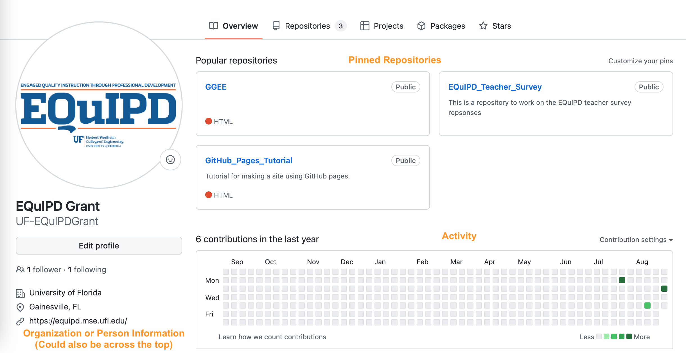

Repositories shows all the repositories that the person or organization has created or forked (made a personal copy from another source). We will talk about cloning and forking in a moment. For this tutorial we will be using **GitHub_Pages_Tutorial** repository.
https://github.com/UF-EQuIPDGrant/GitHub_Pages_Tutorial

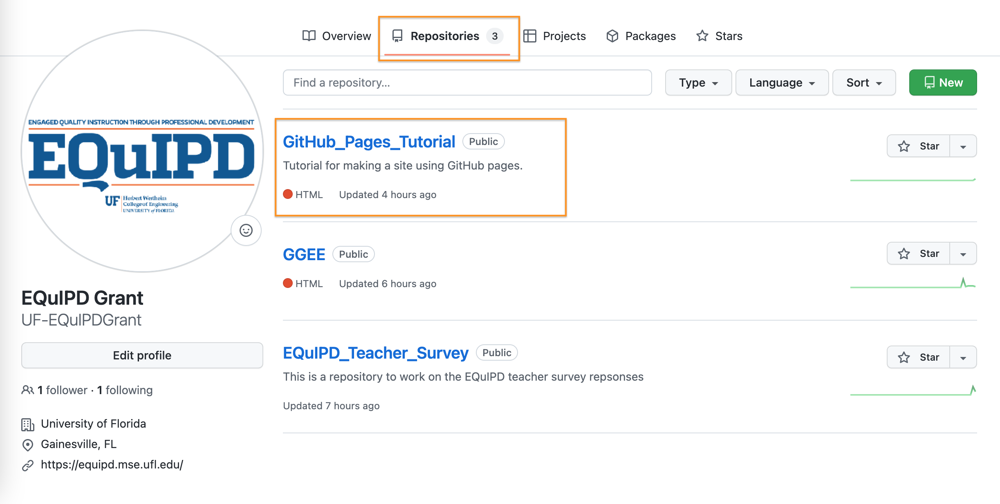

### Creating a New Repository

We will briefly walk through creating a new repository. This is the process you would take when you wanted to start a new project to analyze data or create a GitHub page on your own. 

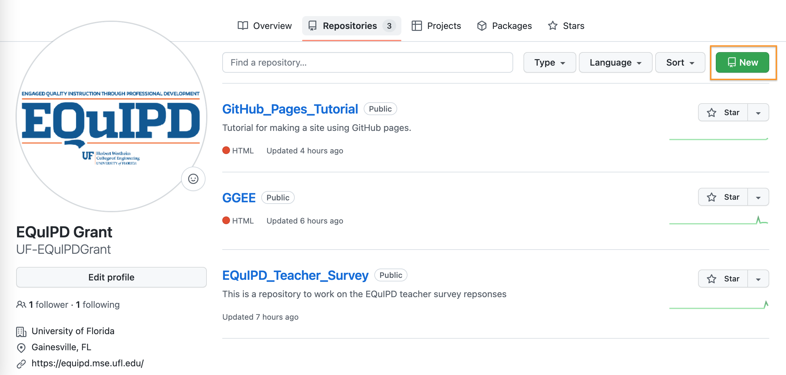


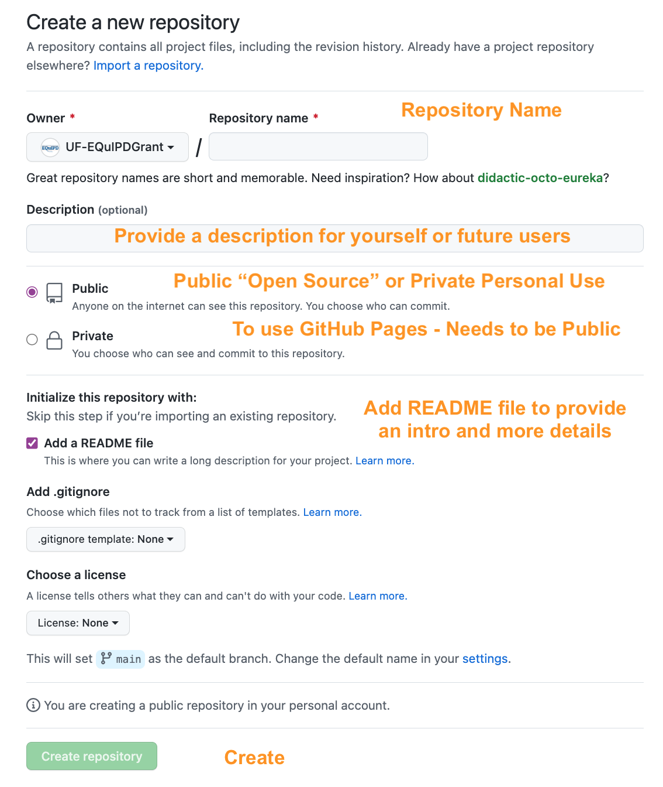{width=75%}

### Forking Versus Cloning

**For this session,** we will be using the **GitHub_Pages_Tutorial** repository as a base. You will now go through the process of creating your own copy of the repository to work in. This is helpful when you have found a resource or are working with a team on a project in GitHub. 

There is an important distinction between cloning a repository and forking a repository.You need to think about how you are working the owner of the repository.

**Cloning** is the act of creating a linked version of the repository local to your account and computer through GitHub desktop. This option is great if you are collaborating with a team to develop something together. The main version is updated by the group. 

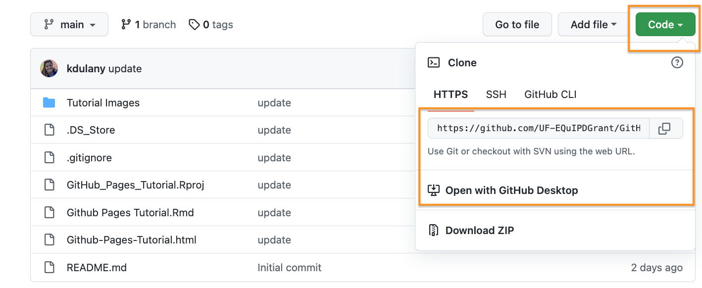

**Forking** is the act of creating your own copy that is not linked to others. This is a great option when you are wanting to modify a repository or project that you found online or if you are working together but not needing to keep a single version. Information and updates from the original will still update from the original source. *In our case we will be Forking our repository so everyone has their own version and we do not overwrite each other.* 

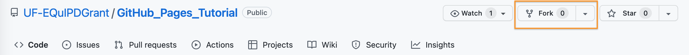{width=75%}

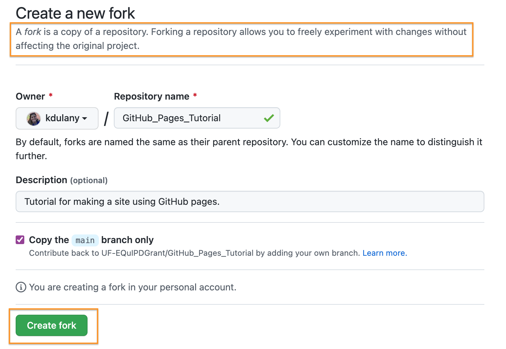{width=75%}

Once you create your forked repository we then move to GitHub Desktop

### GitHub Desktop

GitHub desktop is the interface between R Studio and GitHub. When updates are made by the host of the repository or updates are made by you, the changes are documented and shown in GitHub desktop. History provides information on who, when, and what was updated. This is part of the version control. If your repository is forked then the only updates are coming from the main page and you. If you have a cloned repository, you will see updates from your collaborators. 

Use Fetch/Pull to get new information from the main server. Use Commit to update or Push your changes to the repository. You must enter a small description to be able to commit the changes. You will then be prompted to Push that information. You will see the updates online on GitHub. 

Use open in RStudio to open the project in an editor workspace or use Show in Finder toview the documents in this repository. 

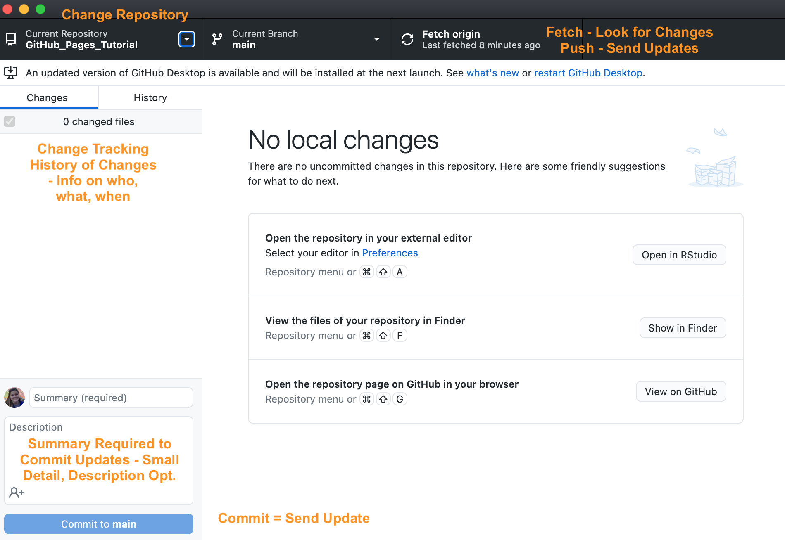{width=75%}

When you drop down the selection tool to navigate between repositories, there should be a forked symbol next to the GitHub Pages Tutorial repository. A book symbol notifies that a repository is a clone. 


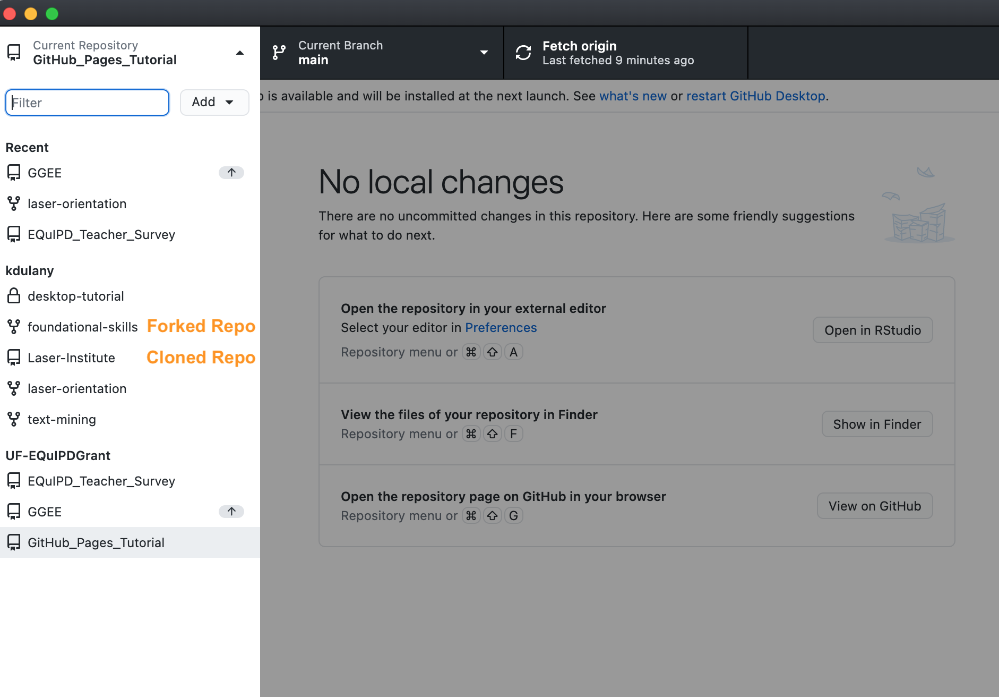{width=75%}

Let's move into the basics of R Markdown.

# R Markdown Formatting
This is an R Markdown document. Markdown is a simple formatting syntax for authoring HTML, PDF, and MS Word documents. For more details on using R Markdown see <http://rmarkdown.rstudio.com>.

First thing we are going to do for this tutorial is "knit" this document using the knit button at the top of the window. Knitting is rendering the R Markdown file into the designated form. In our case, we are using R Markdown to create an html document. You can use this to create word documents, presentations, pdf, and more. 

We will then see this document in a preview window and we are then going to select "Open in Browser" to view the HTML document in a browser window. This will be a reference for us as we move through the document to see what the R Markdown code and formatting looks like in its final form. Knitting while building your document allows you to preview the document and view it for any bugs or test new features. 

## YAML Header

The first part of an R Markdown page is the YAML header. This is where you title the page, add an author, set the date, and choose a file type to process into. YAML allows you to format the output of the document you are producing with elements like themes, various types of tables of contents, section numbering, and figure sizes. 

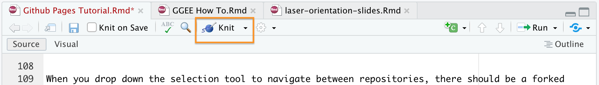{width=75%}

YAML stands for: YAML Ain't Markup Language™ and is a human-friendly data serialization language for all programming languages.

This resource provides a good amount of information on formatting your document. 
https://bookdown.org/yihui/rmarkdown/html-document.html

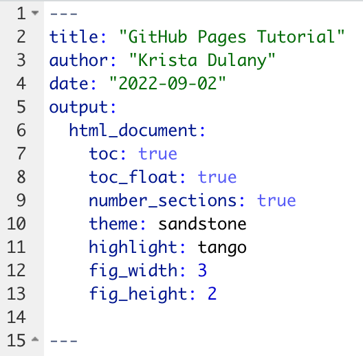{width=50%}

### Update the YAML header

We are going to change the author to your name, as this is your version of the document. Do that by writing your name in place of mine in the header. Now knit the document to update and view your changes.

We are now going to change the theme of the document.Choose a theme from the options below and replace sandstone:
cerulean
cosmo
readable

Knit the document to view the changes. 
Themes are locatated here: https://www.datadreaming.org/post/r-markdown-theme-gallery/

**More Formatting References**
https://www.datadreaming.org/post/r-markdown-theme-gallery/
https://rmarkdown.rstudio.com/authoring_basics.html
https://bookdown.org/yihui/rmarkdown/html-document.html

## Text Formatting

You write in the R Markdown the same way you would write in a word processor. 

Reference for basic  text formatting https://rmarkdown.rstudio.com/lesson-8.html 

### Bold & Italics

**Bold** - double asterix before and after the word or phrase

*Italics* - single asterix before and after the word or phrase 

### Paragraph Spacing

To make paragraphs or new lines of text, there needs to be a line added between the text. 

No spacing:

This is sentence 1.
This is sentence 2. 

New Paragraph:

This is sentence 1.

This is sentence 2.

### Headers

To designate section headers, we use the pound (#) symbol at the start of a new line. The number of symbols indicates the layer of heading and the enumeration (if added). There must be a space between the last # and the first letter of the heading. 

One # - Main Heading

Two ## - Sub Heading

Three ### - Sub - Sub Heading

### Links

You can paste in links as they are and they automatically hyperlink https://rmarkdown.rstudio.com/lesson-8.html 

To jump to sections in the document use the following code: [Section Header]. The name of the section within the brackets needs to match a section name exactly, else it will not work. 

[Text Formatting] Click the link to hop back to text formatting.

## Image Insert

A big part of a webpage is displaying images or documents. Use the piece of code below to display images and preview word or PDF documents. *Note* the viewer for PDF is very shallow and shows a small portion of the page.


{width=50%}

We are going to grab the file path to insert a cute alligator into the page. 
To grab the file path, go to the file, select get info, and copy the file path. 

Documents > GitHub > GitHub_Pages_Tutorial > Images > Gator.png

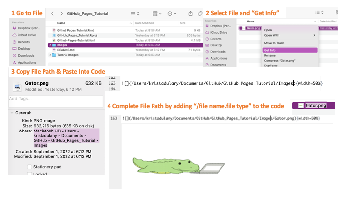


### Inserting Code Chunks
Code Chunks are used to run code in your document. If you want to create a document that steps students through a programming activity, you could use something like this.

To insert a code chunk, go to Code> Insert Chunk or use the following shortcuts depending on your device: Ctrl + Alt + I (Cmd + Option + I on macOS).

```{r}
#Below is code you would use to install packages to do certain tasks in R. They are commented out because we do not need them for this tutorial


#install.packages("readxl")
#install.packages("knitr")
#install.packages("tidyverse")

#library(readxl)
#library(knitr)
#library(tidyverse)

```


When you click the **Knit** button a document will be generated that includes both content as well as the output of any embedded R code chunks within the document. You can embed an R code chunk like this:

```{r cars}
##Summary table of "cars" data
summary(cars)
```

### Including Plots

You can also embed plots, for example:

```{r pressure, echo=FALSE}

plot(pressure)

```

Note that the `echo = FALSE` parameter was added to the code chunk to prevent printing of the R code that generated the plot.

There are other ways to plot data in R. That would require a whole separate training. The most common way is using ggplot.

# Publishing to GitHub Pages

Now that we have our document ready to go we are going to want to host it for others to view. GitHub hosts webpages through GitHub pages. **This feature is available for free when accounts and repositories are set to public.**

1. We are going to Save our R Markdown File

2. Then we are going to Knit the page

3. Then we go to GitHub Desktop and Commit the edits and updates to the repository

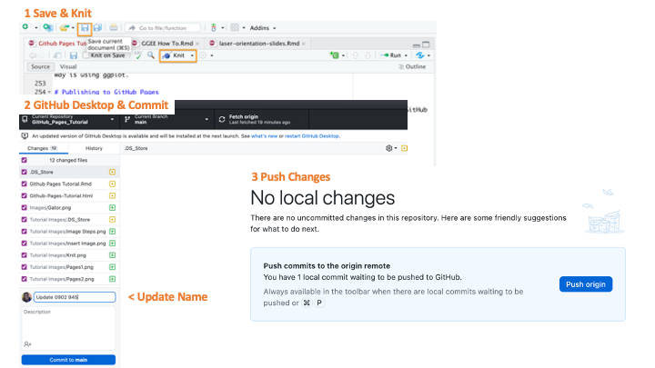

4. Go to **your** GitHub page on the browser 

5. Select the GitHub Pages Tutorial Repository in your profile

6. Open the **Settings** option


7. Select Pages from the left hand menu

8. For your page to be active, you need to identify which **branch** to publish. In our case, we only have one **main**. Press save. 

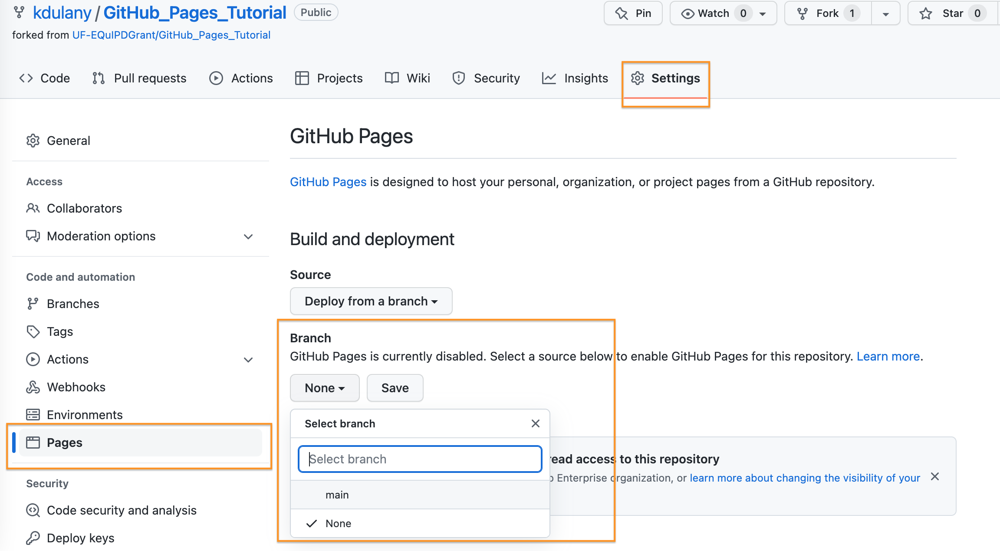

9. Be patient and refresh and your webpage. A link will display at the top. This is the base link for your repository. 

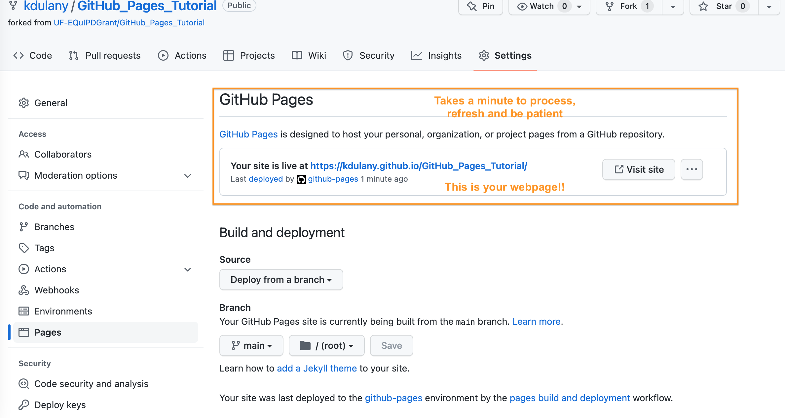

10. Then you need to visit page or copy the start of the url. 

11. Go back to your files in the repository and select the GitHub Pages Tutorial.html

12. At the top of the page, copy the header: Github-Pages-Tutorial.html and paste it to the end of the URL. *Do not copy before the / that directory is already in the url you have* This link is what you would publish or share.

*This will update as you work on your content in R markdown. Follow steps 1-3 to update your page. Note: There is a bit of a delay in updating across so hang in there and it will eventually refresh and load.*


**Congratulations you just hosted your first GitHub Page!**
 

# Additional Resources

**Cheatsheet**
https://www.rstudio.com/wp-content/uploads/2015/02/rmarkdown-cheatsheet.pdf 

**Formatting References**
https://rmarkdown.rstudio.com/authoring_basics.html
https://bookdown.org/yihui/rmarkdown/html-document.html
 